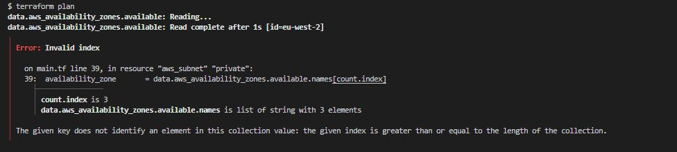
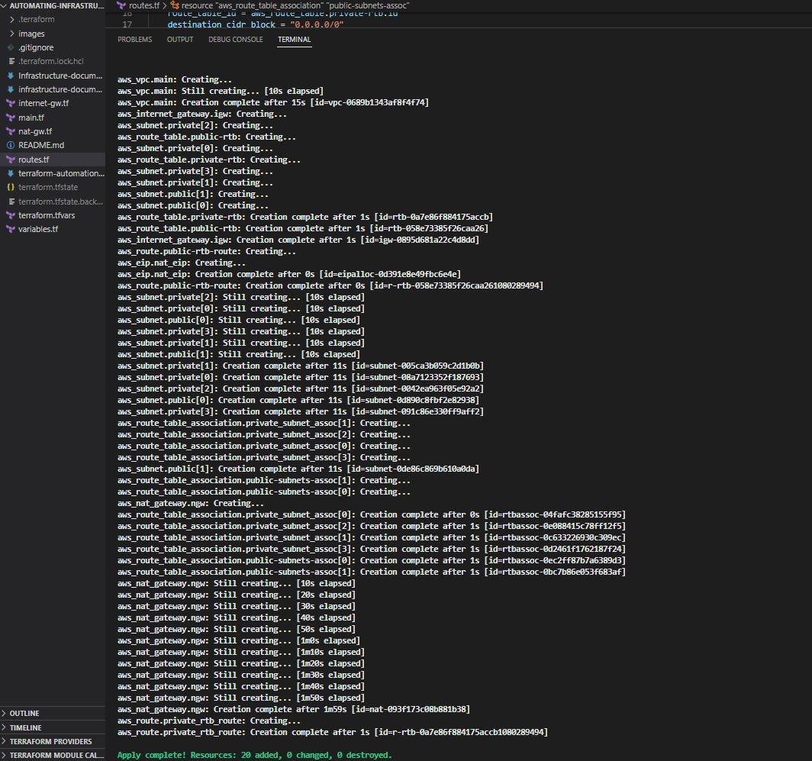
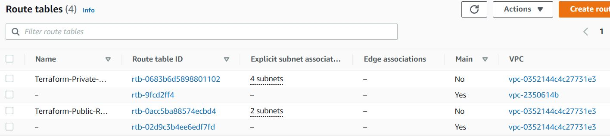
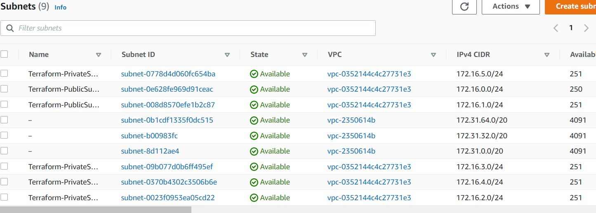
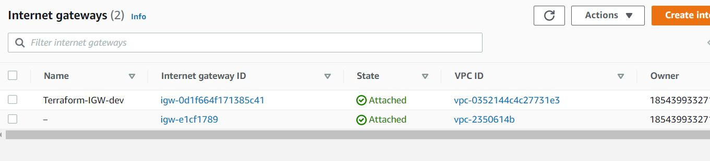
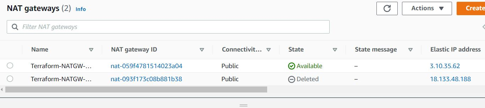

### Next was to create the 4 private subnets in our VPC
# create private subnets
```
resource "aws_subnet" "private" {
  count                   = var.preferred_number_of_private_subnets == null ? length(data.aws_availability_zones.available.names) : var.preferred_number_of_private_subnets
  vpc_id                  = aws_vpc.main.id
  cidr_block              = cidrsubnet(var.vpc_cidr, 8, count.index)
  map_public_ip_on_launch = true
 availability_zone  = data.aws_availability_zones.available.names[count.index]
 }
```

I got an error running terraform plan pointing to the AZ index count for the private subnets.




-- This error got fixed by wrapping the AZ list in an element function

```
resource "aws_subnet" "private" {
  count                   = var.preferred_number_of_private_subnets == null ? length(data.aws_availability_zones.available.names) : var.preferred_number_of_private_subnets
  vpc_id                  = aws_vpc.main.id
  cidr_block              = cidrsubnet(var.vpc_cidr, 8, count.index)
  map_public_ip_on_launch = true
 availability_zone = element(data.aws_availability_zones.available.names[*], count.index)
 }
```

### Before continuing, let's implement tagging for all our resources

### Here, I will create the tag variable in variables.tf
```
variable "tags" {
  description = "A mapping of tags to assign to all resources."
  type        = map(string)
  default     = {}
}
```
### create the site wide default tags to be appended to the distinct tags later
```
tags = {
  Enviroment      = "production" 
  Owner-Email     = "dele@deleonabowu.io"
  Managed-By      = "Terraform"
  Billing-Account = "1234567890"
}
```

### To tag our resources we can merge the default tags with the resource name
```
tags = merge(
    var.tags,
    {
      Name = "Name of the resource"
    },
  )
  ```

 ### We shall use the format function to append the default tags to our resource name
  ```
  Name = format("%s-PrivateSubnet-%s",var.name,count.index)
  ```

  ### We also need to ensure that the ip addresses in private and public subnets do not overlap.This we do by adding 2 to count.index for the private subnet cidrsubnet()

  ```
  cidr_block = cidrsubnet(var.vpc_cidr, 8, count.index + 2)
  ```

  ```
  resource "aws_subnet" "private" {
  count                   = var.preferred_number_of_private_subnets == null ? length(data.aws_availability_zones.available.names) : var.preferred_number_of_private_subnets
  vpc_id                  = aws_vpc.main.id
  cidr_block              = cidrsubnet(var.vpc_cidr, 8, count.index + 2)
  map_public_ip_on_launch = true
 //availability_zone       = data.aws_availability_zones.available.names[count.index]
 availability_zone = element(data.aws_availability_zones.available.names[*], count.index)
 }
```


### The next resource to create will be the Internet Gateway

```
resource "aws_internet_gateway" "igw" {
  vpc_id = aws_vpc.main.id

  tags = merge(
    var.tags,
    {
      Name = format("%s-IGW-%s",var.name,var.environment)
    } 
  )
}
```

 ### Then the elastic IP for the NAT Gateway

```
resource "aws_eip" "nat_eip" {
  vpc = true

  depends_on = [aws_internet_gateway.igw]
 tags = merge(
    var.tags,
    {
      Name = format("%s-NATEIP-%s",var.name,var.environment)
    } 
  ) 

}
```

### Next is the NAT Gateway

```
resource "aws_nat_gateway" "ngw" {
  allocation_id = aws_eip.nat_eip.id
  subnet_id     = element(aws_subnet.public.*.id,0)
  depends_on = [aws_internet_gateway.igw]
 tags = merge(
    var.tags,
    {
      Name = format("%s-NATGW-%s",var.name,var.environment)
    } 
  )

  # To ensure proper ordering, it is recommended to add an explicit dependency
  # on the Internet Gateway for the VPC.
  
}
```

## Next, I created the route tables, route and subnet associations

### create private route table
```
resource "aws_route_table" "private-rtb" {
  vpc_id = aws_vpc.main.id

  tags = merge(
    var.tags,
    {
      Name = format("%s-Private-Route-Table", var.name)
    },
  )
}
```

### create route for the private route table and attach the nat gateway

```
resource "aws_route" "private_rtb_route" {
    route_table_id = aws_route_table.private-rtb.id
    destination_cidr_block = "0.0.0.0/0"
    gateway_id = aws_nat_gateway.ngw.id
  }
```

### associate all private subnets to the private route table

```
resource "aws_route_table_association" "private_subnet_assoc" {
    
    count = length(aws_subnet.private[*].id)
    subnet_id = element(aws_subnet.private[*].id, count.index)
    route_table_id = aws_route_table.private-rtb.id
  }

```

### create route table for the public subnets
```
resource "aws_route_table" "public-rtb" {
  vpc_id = aws_vpc.main.id

  tags = merge(
    var.tags,
    {
      Name = format("%s-Public-Route-Table", var.name)
    },
  )
}
```
### create route for the public route table and attach the internet gateway
```
resource "aws_route" "public-rtb-route" {
  route_table_id         = aws_route_table.public-rtb.id
  destination_cidr_block = "0.0.0.0/0"
  gateway_id             = aws_internet_gateway.igw.id
}
```
### associate all public subnets to the public route table
```
resource "aws_route_table_association" "public-subnets-assoc" {
  count          = length(aws_subnet.public[*].id)
  subnet_id      = element(aws_subnet.public[*].id, count.index)
  route_table_id = aws_route_table.public-rtb.id
}
```

### I rannterraform plan and terraform apply which provisioned the following resources to AWS in a multi-az set up:

– Our main vpc
– 2 Public subnets
– 4 Private subnets
– 1 Internet Gateway
– 1 NAT Gateway
– 1 Elastic IP for the NAT Gateway
– 2 Route tables for private and public subnets

### To clean up the code, we did some refactoring and moved some of the code into their own files

### I created the following files:
internet-gw.tf  - The internet gateway 
nat-gw.tf - The nat gateway
routes.tf   - The private and public route tables, routes and subnet associations

``` 
terraform plan
terraform apply
```

### Build was successful and 20 resources added



### route tables


### Subnets



### Internet Gateway



### Nat Gateway



#### Next, I will be creating the Application Load Balancer and the Auto scaling Groups, target groups and listeners
### I would need to create the certificate manager before the ALB
### I would need to create the Application Load balancer before the autoscalling groups

### Lets create the certificate (TLS/SSL)  
### I created a new file certificate.tf

```
touch certificate.tf
```
### I will need to create the certificate, a public zone and validate the certificate with the DNS method

```
# Create the certificate using a wildcard for all the domains created in workachoo.com

resource "aws_acm_certificate" "workachoo" {
  domain_name       = "*.workachoo.com"
  validation_method = "DNS"

  tags = {
    Environment = "dev"
  }

  lifecycle {
    create_before_destroy = true
  }
}

# calling the hosted zone

resource "aws_route53_zone" "workachoo" {
  name = "workachoo.com"
  private_zone = false
}


# selecting validation method
resource "aws_route53_record" "workachoo" {
  for_each = {
    for dvo in aws_acm_certificate.workachoo.domain_validation_options : dvo.domain_name => {
      name   = dvo.resource_record_name
      record = dvo.resource_record_value
      type   = dvo.resource_record_type
    }
  }

  allow_overwrite = true
  name            = each.value.name
  records         = [each.value.record]
  ttl             = 60
  type            = each.value.type
  zone_id         = data.aws_route53_zone.workachoo.zone_id
}

# validate the certificate through DNS method
resource "aws_acm_certificate_validation" "workachoo" {
  certificate_arn         = aws_acm_certificate.workachoo.arn
  validation_record_fqdns = [for record in aws_route53_record.workachoo : record.fqdn]
}

### our A record names will be tooling.workachoo.com and wordpress.workachoo.com

# create records for tooling
resource "aws_route53_record" "tooling" {
  zone_id = data.aws_route53_zone.workachoo.zone_id
  name    = "tooling.workachoo.com"
  type    = "A"

  alias {
    name                   = aws_lb.ext-alb.dns_name
    zone_id                = aws_lb.ext-alb.zone_id
    evaluate_target_health = true
  }
}

# create records for wordpress
resource "aws_route53_record" "wordpress" {
  zone_id = data.aws_route53_zone.workachoo.zone_id
  name    = "wordpress.workachoo.com"
  type    = "A"

  alias {
    name                   = aws_lb.ext-alb.dns_name
    zone_id                = aws_lb.ext-alb.zone_id
    evaluate_target_health = true
  }
}
```


### The next stage is to create the internet facing external application load balancer in a file called albexternal.tf
```
touch albexternal.tf
```


